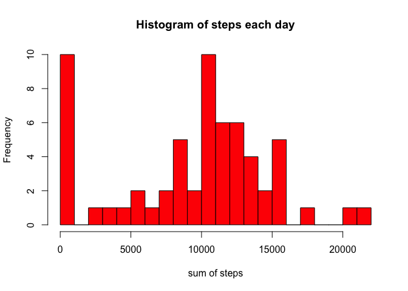
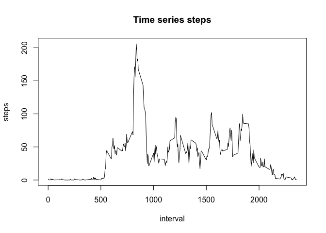
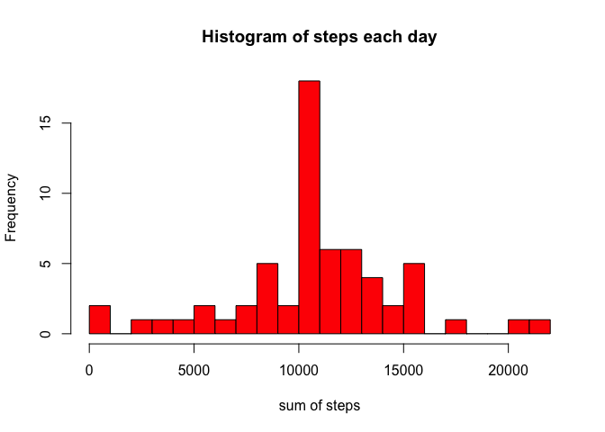

# Reproducible Research: Peer Assessment 1


## Loading and preprocessing the data

```r
## load the required library
library(dplyr)
```

```
## 
## Attaching package: 'dplyr'
## 
## The following object is masked from 'package:stats':
## 
##     filter
## 
## The following objects are masked from 'package:base':
## 
##     intersect, setdiff, setequal, union
```

```r
library(lubridate)
unzip(zipfile = "activity.zip")
data <- read.csv(file = "activity.csv", header = TRUE)
data <- tbl_df(data)
```


## What is mean total number of steps taken per day?

```r
grop_by_date <- group_by(data, date)
sumSteps_each_day <- summarize(grop_by_date, sum(steps, na.rm = TRUE))
colnames(sumSteps_each_day) <- c("date", "sumOfSteps")

hist(sumSteps_each_day$sumOfSteps, xlab = "sum of steps", main = "Histogram of steps each day", breaks = 20, col = "red")
```

 

```r
mean(sumSteps_each_day$sumOfSteps, na.rm = TRUE)
```

```
## [1] 9354.23
```

```r
median(sumSteps_each_day$sumOfSteps, na.rm = TRUE)
```

```
## [1] 10395
```

```r
# meanSteps_each_day <- summarize(grop_by_date, mean(steps, na.rm = TRUE))
# colnames(meanSteps_each_day) <- c("date", "meanOfSteps")
# meanSteps_each_day
```


## What is the average daily activity pattern?

```r
group_by_interval <- group_by(data, interval)
meanSteps_each_interval <- summarize(group_by_interval, mean(steps, na.rm = TRUE))
colnames(meanSteps_each_interval) <- c("interval", "averageSteps")
plot(meanSteps_each_interval$interval, meanSteps_each_interval$averageSteps, type = "l",
                main = "Time series steps", xlab = "interval", ylab = "steps")
```

 

```r
max_row <- subset(meanSteps_each_interval, averageSteps == max(averageSteps))
max_row[1, 1]
```

```
## Source: local data frame [1 x 1]
## 
##   interval
## 1      835
```


## Imputing missing values

```r
## 1.calculate and report the total number of missing values in the data set
missing_value_data <- data[is.na(data$steps),]
nrow(missing_value_data)
```

```
## [1] 2304
```

```r
## 2.fill the NA values with average step in that interval
data <- mutate(data, averageSteps = rep(meanSteps_each_interval$averageSteps, (nrow(data) /nrow(meanSteps_each_interval)) ))
data[is.na(data$steps), 1] <- data[is.na(data$steps), 4]

## 3.create a new data with the missing values filled in
new_data <- select(data, steps:interval)

## 4.
grop_by_date <- group_by(new_data, date)
sumSteps_each_day <- summarize(grop_by_date, sum(steps))
colnames(sumSteps_each_day) <- c("date", "sumOfSteps")

hist(sumSteps_each_day$sumOfSteps, xlab = "sum of steps", main = "Histogram of steps each day", breaks = 20, col = "red")
```

 

```r
mean(sumSteps_each_day$sumOfSteps)
```

```
## [1] 10766.19
```

```r
median(sumSteps_each_day$sumOfSteps)
```

```
## [1] 10766.19
```
**From the resut, compared with the previous one, the gross level improved. Data are centered more around the mean value**


## Are there differences in activity patterns between weekdays and weekends?

```r
new_data$date <- ymd(new_data$date)
new_data <- mutate(new_data, weekdays = weekdays(new_data$date))
weekend <- c("Saturday", "Sunday")

new_data <- mutate(new_data, isWeekend = is.element(new_data$weekdays, weekend))
new_data <- mutate(new_data, weekdays = factor(new_data$isWeekend, labels = c("weekday", "weekend")))
new_data <- select(new_data, steps:weekdays)

weekday_data <- subset(new_data, weekdays == "weekday")
weekday_group_by_interval <- group_by(weekday_data, interval)
weekday_meansteps_eachinterval <- summarise(weekday_group_by_interval, mean(steps))
weekday_meansteps_eachinterval <- mutate(weekday_meansteps_eachinterval, weekdays = rep("weekday", nrow(weekday_meansteps_eachinterval)))
colnames(weekday_meansteps_eachinterval) <- c("interval", "meanSteps", "weekdays")

weekend_data <- subset(new_data, weekdays == "weekend")
weekend_group_by_interval <- group_by(weekend_data, interval)
weekend_meansteps_eachinterval <- summarise(weekend_group_by_interval, mean(steps))
weekend_meansteps_eachinterval <- mutate(weekend_meansteps_eachinterval, weekdays = rep("weekend", nrow(weekend_meansteps_eachinterval)))
colnames(weekend_meansteps_eachinterval) <- c("interval", "meanSteps", "weekdays")


library(lattice)

df_final <- rbind(weekday_meansteps_eachinterval, weekend_meansteps_eachinterval)

xyplot(meanSteps ~ interval | weekdays, data = df_final, layout = c(1, 2), 
       type = "l", ylab = "Number of steps")
```

 
